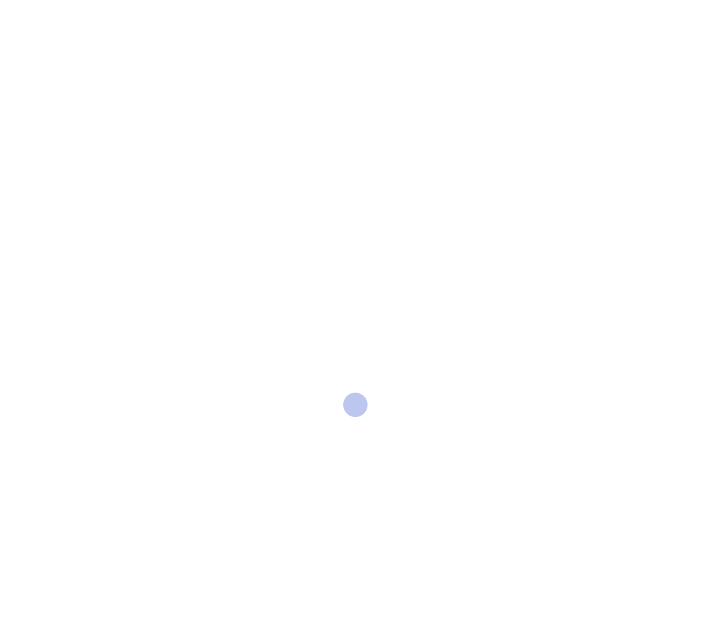

<p align="center">
  
</p>

## An open-source testing framework for GameMaker libraries, extensions and (_hopefully_) prefabs, with a focus on simplicity and ease of use.

[](LICENSE)
[](https://github.com/DAndrewBox/GM-Testing-Library)
[](https://github.com/DAndrewBox/GM-Testing-Library/releases)

### 🗂️ **Compatible with GameMaker versions:**


### 📅 Last updated: 2024-07-20

---

#### 🏆 This project has been nominated for the [**GameMaker Awards 2024**](https://opr.as/GMA24-Vote), if you like this project or want to support me, please consider voting for it!

<br />
<p align="center">
  
</p>

---

### ✨ Author & Collaborators

Originally created by [**@DAndrewBox**](https://twitter.com/DAndrewBox_).

[](https://github.com/DAndrewBox)

### 🙏 Special Thanks & Inspirations

- [**YoYo Games**](https://www.gamemaker.io/) for creating GameMaker.
- [**React Testing Library**](https://testing-library.com/) & [**Jest**](https://jestjs.io/) for being the main inspiration.

---

### 📋 Table of Contents

- [🔧 Versioning & Compatibility](https://github.com/DAndrewBox/GM-Testing-Library/wiki)
- [🌱 Installation](https://github.com/DAndrewBox/GM-Testing-Library/wiki/Getting-Started)
- [📚 Documentation](https://github.com/DAndrewBox/GM-Testing-Library/wiki/Documentation)
- [🧾 Usage Example](#-usage-example)
- [📜 License](#-license)
- [🤝 Contributing](#-contributing)

---

### 🧾 Usage Example

```gml
// test_player.gml
suite(function() {
  section("Test Player Behaviours", function() {
    test("Should create obj_Player", function() {
      var _obj = create(0, 0, obj_player);
      expect(_obj).toBeGreaterThan(-1);
      instance_destroy(_obj);
    });

    test("Should move obj_Player to the right", function() {
      var _obj = create(0, 0, obj_player);

      simulateKeyHold(vk_right);
      simulateFrameWait(1);
      simulateKeyRelease(vk_right);

      expect(_obj.x).toBeGreaterThan(_obj.xstart);

      instance_destroy(_obj);
    });

    test("Should move obj_Player to the left", function() {
      var _obj = create(0, 0, obj_player);

      simulateKeyHold(vk_left);
      simulateFrameWait(1);
      simulateKeyRelease(vk_left);

      expect(_obj.x).toBeLessThan(_obj.xstart);

      instance_destroy(_obj);
    });
  });
});
```

---

### 📜 License

This project is licensed under the MIT License. See the [LICENSE](LICENSE) file for more details.

---

### 🤝 Contributing

If you want to contribute to this project, you can do so by forking this repository, finding the addecuate branch and submitting a pull request.

You can also submit an issue if you find a bug or want to suggest a new feature, I'm open to add new features to this extension as long as I can see a use for it.
